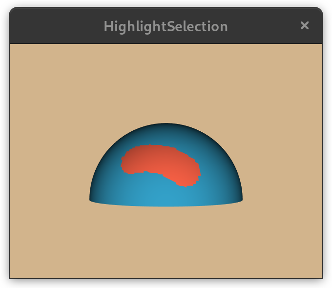
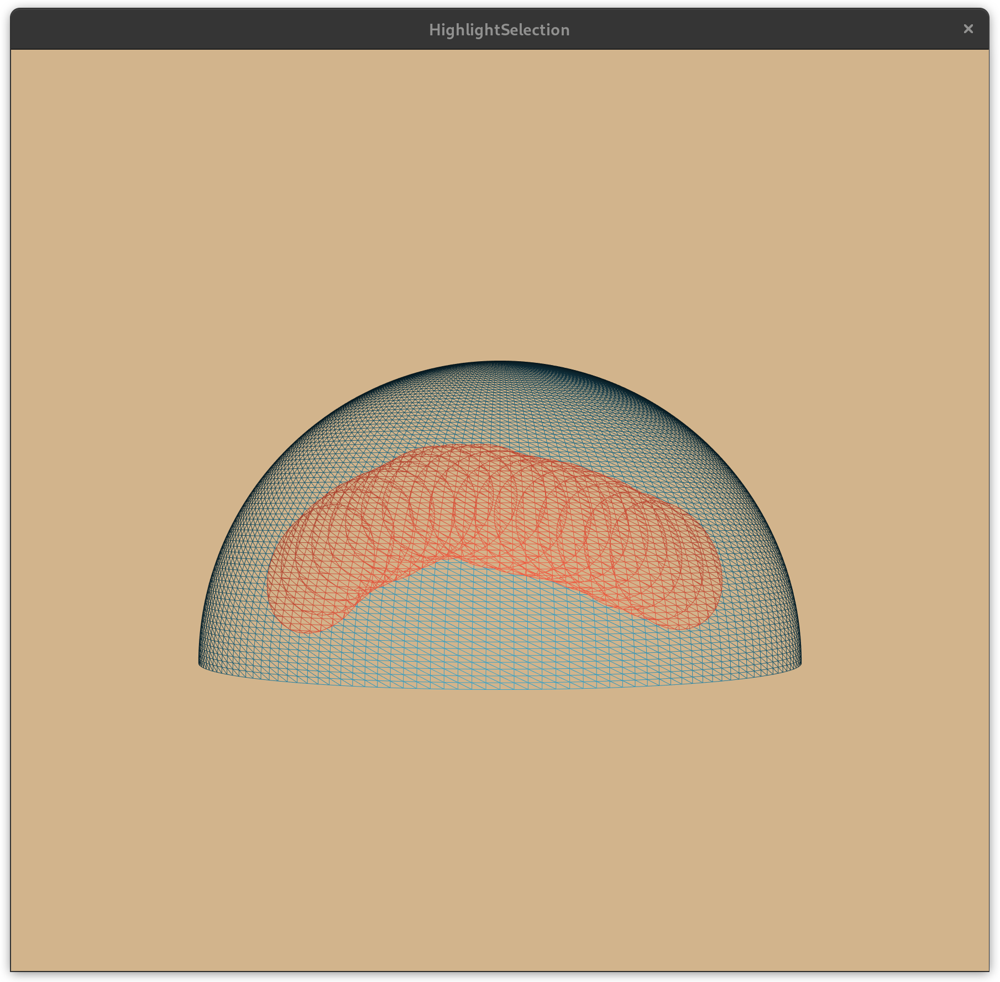

Python exercises
=====================

1. **Transformations:** Make a chain of 3 homogeneous transformations and
   apply them to a point. Make an intrinsic and an extrinsic version
   (coordinate system is moved). Express this using a chain of
   `vtkTransform` to get understanding of `PostMultiply` and
   `PreMultiply`. Demonstrate how the state of the transform can be
   pushed and popped onto an internal stack using `Push()` and
   `Pop()`.
   
2. **Pipeline metadata:** Sending meta data downstream in a pipeline. As an example, when reading a header
   we can send information downstream information whether content are present or not.

3. **Advanced filter:** Make a filter that compute not only distances from one mesh to another but also gradients
 or signed directions (gradient with unit length).

<figure>

<figcaption>DisplacementFilter</figcaption>

</figure>

4. **Advanced pipeline:**

<table>
  <tr>
    <td>
      <figure>
        

          
        

        

          <figcaption>Displacement Filter</figcaption>
        

      </figure>
    </td>
    <td>
      <figure>
        

          
        

        

          <figcaption>Pipeline</figcaption>
        

      </figure>
    </td>
    <td>
      <figure>
        

          
        

        

          <figcaption>Pipeline</figcaption>
        

      </figure>
    </td>
  </tr>
</table>
